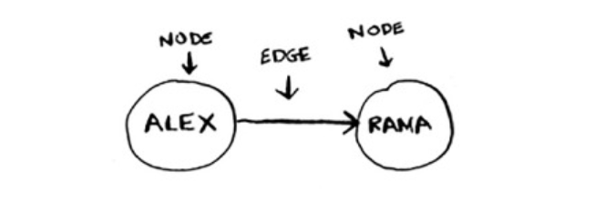

# Graphs

A graph models a set of connections.
Each graph is made up of nodes and edges.

When a node is directly connected to another node like in the image above, both nodes are known as ***neighbors***.
