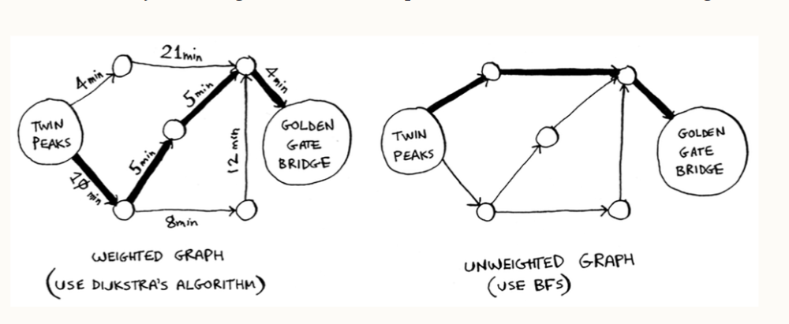

# Dijkstra's algorithm

Breadth-first search helps to find the smallest number of edges (segments) it takes to get to a destination (the shortest path), but it does not really take into account the actual length of the edges (the distance from one node to another along the edge).
If it did, there could be other paths that might not necessarily be the shortest paths, but they'll have smaller distances along the edges, which when combined can produces a path with a smaller distance (the fastest path).
This is what Dijktra's algorithm does - finds the fastest path between two points.

Four steps to Dijkstra's algorithm:
1. Find the cheapest node. This is the node you can get to in the least amount of time
2. Update the costs of the neighbors of this node i.e. find the distance between the neighbors and their neighboring nodes
3. Repeat until you have done this for every node on the graph
4. Calculate the final path

The difference between Dijkstra's algorithm and breadth-first search is that dijkstra assigns a **weight** (a number) to each edge to help get the shortest path with BFS just uses the number of edges it takes to get to the destination.

## Cycles

Graphs can have cycles, which is a node you can start at, travel through its neighbors and end up at the starting position. E.g. an undirected graph is a cycle.
Since you can travel through a cycle and end up back at its starting position, including the weights for the edges in dijkstra's algorithm will just add up to the total weight for no reason.

Dijkstra's algorithm only works on graphs with no cycles or on graphs with a positive-weight cycle.