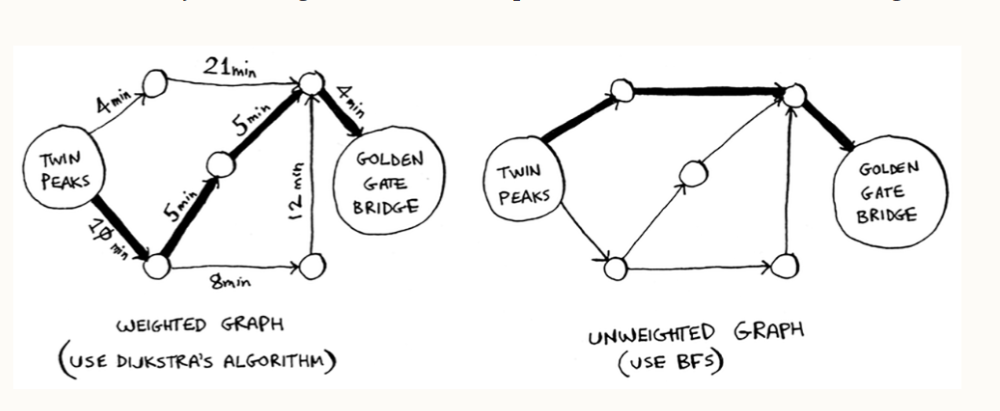

# Dijkstra's algorithm

Breadth-first search helps to find the smallest number of edges (segments) it takes to get to a destination (the shortest path), but it does not really take into account the actual length of the edges (the distance from one node to another along the edge).
If it did, there could be other paths that might not necessarily be the shortest paths, but they'll have smaller distances along the edges, which when combined can produces a path with a smaller distance (the fastest path).
This is what Dijktra's algorithm does - finds the fastest path between two points.

## Implementation Steps

To go from a source node to a destination node on a graph:
1. **Initialize a priority queue**: a list of all nodes on the graph and their distances (from start), sorted from lowest to the highest distance. 
2. **Process the smallest distance node**: at each step, remove the node with the smallest distance from the priority queue (dequeue a node). At the start, this will be the starting node with a distance of 0
3. **Relaxation**: For each neighbor of the current node, you calculate the potential new distance through the current node. If this new distance is shorter than the previously known distance to that neighbor, you update it and add (or re-add) the neighbor to the priority queue with the updated distance.
4. **Finalization**: Once a node is dequeued (processed), it is considered "finalized" because Dijkstra assumes the shortest path to that node has been found.

- If a node hasn't been reached yet in a priority queue, it is assigned an infinity distqance and will hence be at the bottom of the queue.
- Also if a node only leads to a node that has been previously reached, then that path is ignored because the search should be looking to advance the path to the destination, not go back to the start.

The difference between Dijkstra's algorithm and breadth-first search is that dijkstra assigns a **weight** (a number) to each edge to help get the shortest path with BFS just uses the number of edges it takes to get to the destination.

## Negative weights
Due to the fact that Dijkstra considers a node to be "finalized" once its processed, it does not account for the possibility that the node may need to be revisited later due to a negative edge from another part of the graph.
As a result, when graphs have negative weights, Dijkstra fails to find the accurate shortest distance between two nodes.
In a case like this, an algorithm called ***Bellman-Ford's*** is used.

The reason Dijkstra does not allow a node to be revisited is for efficiency purposes, because doing that will make the search more complex and take longer to arrive at the final path.

Most real world applications of Dijkstra such as GPS systems will not have to deal with negative weights since road networks and travel times are always positive. 

## Cycles

Graphs can have cycles, which is a node you can start at, travel through its neighbors and end up at the starting position. E.g. an undirected graph is a cycle.
Since you can travel through a cycle and end up back at its starting position, including the weights for the edges in dijkstra's algorithm will just add up to the total weight for no reason.

Dijkstra's algorithm only works on graphs with no cycles or on graphs with a positive-weight cycle.

Additional reference: [Dijkstra's algorithm - computerphille](https://www.youtube.com/watch?v=GazC3A4OQTE)