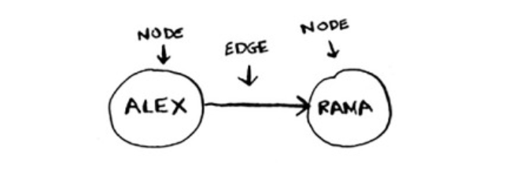

# Graphs

A graph models a set of connections.
Each graph is made up of nodes and edges.



When a node is directly connected to another node like in the image above, both nodes are known as ***neighbors***. A node is connected to its neighbor through an edge.

To implement graphs, we use a ***hash table*** to express the relationships between nodes by mapping a node to its neighbors through a key/value pair relationship.

```py

graph = {}

# mapping you to neighbors alice, bob and claire
graph["you"] = ["alice", "bob", "claire"]

# bob also has neighbors anuj and peggy
graph["bob"] = ["anuj", "peggy"]

# anuj has no neighbors
graph["anuj"] = []
```
A **directed graph** is a graph with arrows, with the relationship following the direction of the arrows. e.g. (rama -> adit could mean "rama owes adit money")

An **undirected graph** have no arrows and the relationship goes both ways


When a graph has items that follow each other in an order, it's called a ***topological graph***

**Trees** are special graphs where all the edges point downward with no edge pointing back up.
